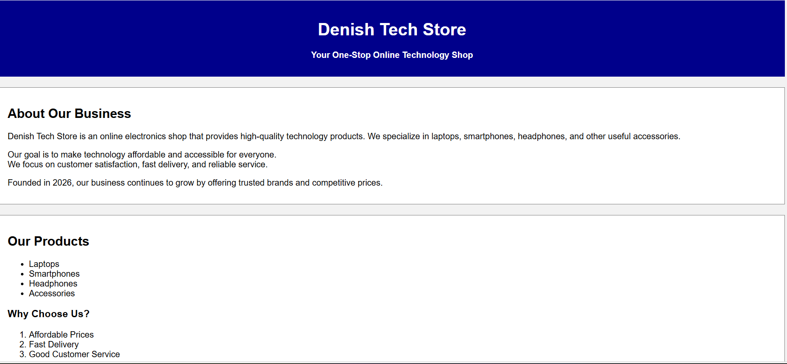
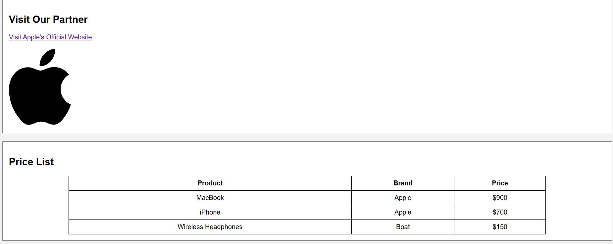
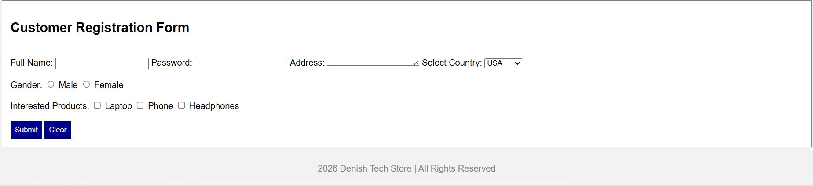

# lab0-html-tech-store
HTML-based e-commerce website project (Lab 0) demonstrating basic web development concepts including structure, forms, and tables.

## Objectives
- Understand basic HTML structure
- Create a simple business webpage
- Design product listings using tables
- Build a customer registration form
- Practice linking external websites

## Technologies Used
- HTML5
- Basic web development structure

## Features
- Business introduction section
- Product listing table (laptops, smartphones, accessories)
- Customer registration form
- External link to Apple official website
- Simple structured layout for user interaction

## Screenshots

### Homepage
(Add screenshot of main page here)

### Product List

### Registration Form

## What I Learned
- How to structure a webpage using HTML
- How to create tables and forms
- How to organize content for a basic website
- Introduction to building user input forms

## Future Improvements
- Add CSS for better design and styling
- Add JavaScript for form validation
- Convert into a responsive e-commerce website
- Add backend functionality for user registration

## Author
Denish Adhikari  
Cybersecurity Student | Web Development Basics
